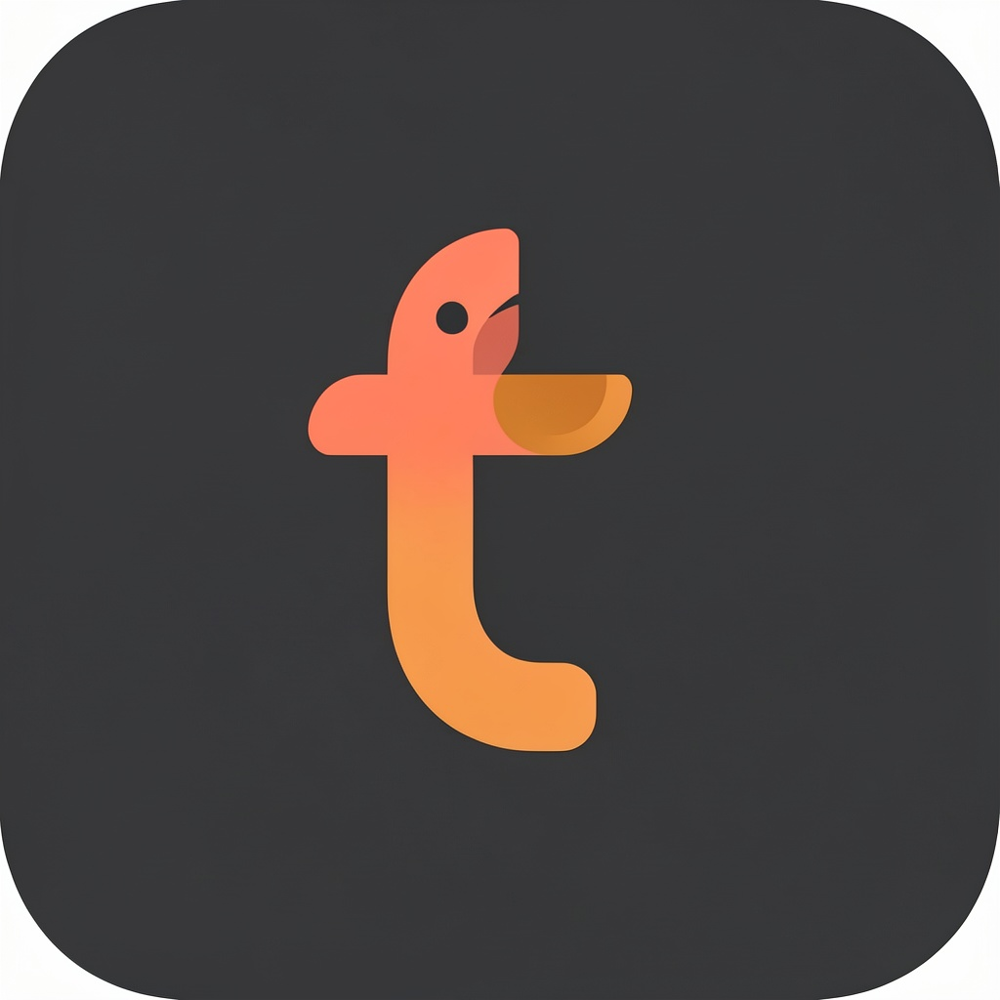

## Tootsie — a Material You Mastodon client with AI Personalization and Fediverse Collections

> A fork of [Moshidon](https://github.com/LucasGGamerM/moshidon) (itself a fork of [megalodon](https://github.com/sk22/megalodon)). Tootsie adds **AI-powered timeline personalization** and full support for Mastodon 4.6's [Collections](https://blog.joinmastodon.org/2026/04/designing-collections/) feature ([FEP-7aa9](https://w3id.org/fep/7aa9)) on top of an already feature-rich, modern Android client.

## Features

### AI Personalization

Tootsie can learn your interests from your Mastodon activity and build a personalized timeline just for you.

- **Topic inference** — analyzes your favorites and boosts via an LLM to identify 5-15 topics you care about (e.g., "Linux", "Space exploration", "Indie games")
- **Personal timeline** — searches Mastodon globally for posts matching your topics, merges and deduplicates results across topics, and displays them in reverse chronological order
- **Topic tags** — each post in the Personal timeline shows which topic(s) matched it (e.g., "✦ Linux · Open Source"), so you can see why it appeared and curate your topics
- **LLM filtering** — search results are optionally refined through an LLM to remove false positives (e.g., a post about "creating space in your life" won't appear under "Space Exploration")
- **Full control** — enable/disable individual topics, add custom topics, re-infer from your latest activity, adjust post count
- **Bring your own key** — works with any OpenAI-compatible API (OpenRouter, local LLMs, etc.). Configure API key, URL, and model in Settings → AI Personalization

### Fediverse Collections

Full first-class support for Mastodon 4.6's Collections feature ([FEP-7aa9](https://w3id.org/fep/7aa9)):

- **Create & manage collections** — create, rename, and delete collections of up to 25 profiles
- **Add & remove members** — add any profile to a collection; members are notified via `added_to_collection`
- **Opt-in respect** — collections respect each user's `interactionPolicy.canFeature` preference
- **Revoke support** — collection members can revoke their inclusion; per-collection and global revoke
- **Notifications** — `added_to_collection` and `collection_update` notification types
- **Browse & share** — view collection contents, share collection URLs

### Everything else from Moshidon

Tootsie inherits everything Moshidon does well:

- Material You theming with dynamic colors
- Full federated, local, and bubble timelines
- Drafts & scheduled posts
- Bookmarks and favorites
- Multi-account support
- Alt-text accessibility reminders
- Custom emoji in display names
- Content warning and filter support
- Translation support
- Push notifications
- And much more

## Download

| Channel | Link |
|---|---|
| GitHub Releases (pre-release) | [Releases](https://github.com/jcrabapple/tootsie/releases) |

Tootsie is pre-alpha. Expect rough edges. APKs are available on GitHub Releases for testing.

## Build from source

```bash
git clone https://github.com/jcrabapple/tootsie
cd tootsie
./gradlew :mastodon:assembleGithubDebug
# APK at: mastodon/build/outputs/apk/githubDebug/tootsie-githubDebug.apk
```

Requires JDK 17+, Android SDK with platform 35, and NDK r26+ for some dependencies.

## Upstream

Tootsie tracks Moshidon's `rewrite` branch. To pull upstream changes:

```bash
git fetch upstream
git merge upstream/rewrite
```

We rebase selectively — Moshidon's Collections implementation will likely land eventually, and we'll absorb it when it does.

## Credits

Tootsie is built on the work of:

- **[Moshidon](https://github.com/LucasGGamerM/moshidon)** by LucasGGamerM and contributors — the actual app
- **[megalodon](https://github.com/sk22/megalodon)** by sk22 — Moshidon's upstream fork
- **[Mastodon for Android](https://github.com/mastodon/mastodon-android)** by Mastodon gGmbH — the original official client

If you find Tootsie useful, please consider supporting [Moshidon](https://github.com/sponsors/LucasGGamerM) — without them, none of this exists.

## License

GNU GPL v3.0, inherited from Moshidon and upstream Mastodon for Android.
